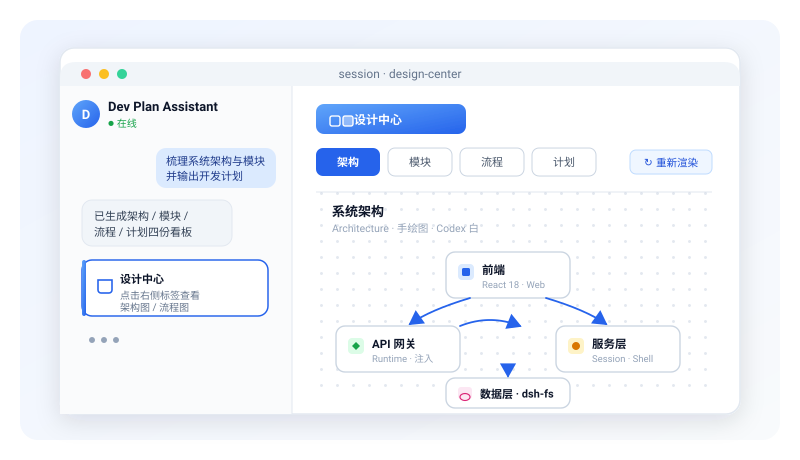

<p align="center">
  <a href="https://github.com/ice-deep-dream/dsh-plugin-design-center">
    
  </a>
</p>

<p align="center">
  
  
  
  
  
</p>

<p align="center"><b>简体中文</b> · <a href="./README.en.md">English</a></p>

<p align="center">
  <b>@cryodream/dsh-client-ui-design-center</b>
</p>

> 为 [deepseek-harness](https://github.com/deepseek-ai/deepseek-harness) 打造的设计中心会话标签插件：把架构 / 模块 / 流程 / 计划看板原生渲染进对话面板，支持就地编辑与重新渲染。

<p align="center">
  
</p>

## 特性

| 能力 | 说明 |
| --- | --- |
| 四合一看板 | 在一个专属会话标签内组织**架构**、**模块**、**流程**、**计划**四个子页签 |
| 原生对话集成 | 以 dsh 客户端插件形式注入，不弹窗、不跳页，与会话体验无缝衔接 |
| 手绘风 SVG | 渲染 paper 手绘风格图表，提供 Codex 纯白简约主题，干净克制 |
| 动画流程 | 流程图按步骤动画播放，连线使用实心箭头并自动裁切，避免重叠 |
| 就地编辑 | 直接在面板内编辑计划卡片（标题、版本、更新时间、正文） |
| 重新渲染 | 编辑后调用宿主端 Python 渲染器，一键重绘架构与流程图 |
| 技能协同 | 读取 `dev-plan-assistant` 技能生成的四份设计产物，开箱即用 |

## 工作方式

插件读取 `dev-plan-assistant` 技能在项目中生成的四份设计文件：

| 文件 | 形态 | 渲染 |
| --- | --- | --- |
| 架构图 | SVG | 架构子页签 |
| 模块图 | SVG | 模块子页签 |
| 流程图 | SVG（动画） | 流程子页签 |
| 开发计划 | JSON | 计划卡片，可编辑 |

安装后，打开任意会话即可在对话面板看到「设计中心」标签。

## 前置条件

本插件**不内置**设计看板的生成能力，它是 [`dev-plan-assistant`](https://github.com/ice-deep-dream/skills-dev-plan-assistant) 技能的 UI 载体，运行时依赖该技能：

- 看板内容（架构 / 模块 / 流程图 SVG 与 `plan.json`）由技能生成到项目的 `docs/design/diagrams/` 目录，插件只负责读取与渲染；
- 点击「↻ 重新渲染」时，插件会调用宿主上 `~/.agents/skills/dev-plan-assistant/diagrams/archscribe/scripts/render_animated_diagram.py` 重绘图表，因此**宿主必须已安装该技能并具备 Python 3 环境**。

请先安装技能：

```bash
# 将 dev-plan-assistant 技能克隆到 dsh 技能目录
git clone https://github.com/ice-deep-dream/skills-dev-plan-assistant.git "$HOME/.agents/skills/dev-plan-assistant"

# 重渲染依赖 Python 3（macOS / Linux 通常自带，Windows 可从 python.org 安装）
python --version
```

> 仅查看已生成的 SVG 看板时无需技能或 Python；但要（重新）生成图表，二者缺一不可。

## 安装

满足前置条件后，通过 dsh 插件管理器以 web profile 安装：

```bash
dsh plugin --profile web add git+https://github.com/ice-deep-dream/dsh-plugin-design-center.git
```

随后重启 dsh（或重载 web profile），进入会话即可看到设计中心标签。首次使用请在会话中让 `dev-plan-assistant` 完成项目初始化，生成 `docs/design/diagrams/` 下的看板文件。

## 开发

本仓库为独立发布仓库，产物位于 `lib/`。从 harness 源码构建后，将编译产物同步到此处的 `lib/` 目录即可。

目录结构：

```text
dsh-plugin-design-center/
├── assets/                  # README 图标与功能展示图
├── lib/                     # 编译产物（随包发布）
│   ├── index.js             # 插件入口
│   ├── client.js            # 客户端注入（设计中心标签）
│   ├── invariant.js         # 运行时常量（PACKAGE_NAME 等）
│   └── types/               # TypeScript 类型声明
├── package.json
├── .gitignore
├── README.md
└── README.en.md
```

运行时依赖宿主注入以下客户端模块：`@deepseek-ai/dsh-client-locale`、`@deepseek-ai/dsh-client-runtime`、`@deepseek-ai/dsh-client-ui-conversation`，并要求 React >= 18。

## 许可证

[MIT](./LICENSE)